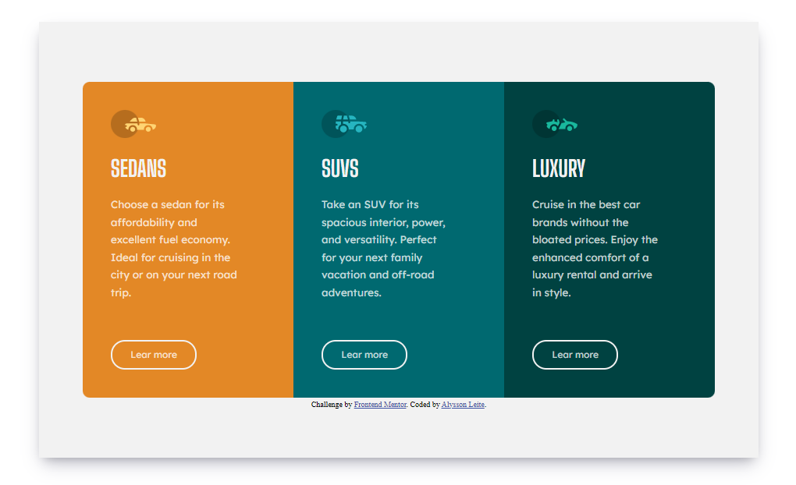
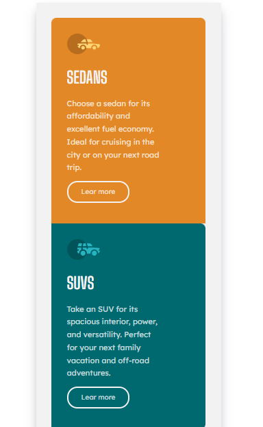

# 3-column card - Frontend Mentor

>Frontend Mentor

## Índice
- [Imagem do projeto](#imagem-do-projeto)
- [Tecnologias 💻](#tecnologias-💻)
- [O que aprendi](#o-que-aprendi)
- [Contato](#contato)

## Imagem do projeto

Projeto construído como um desafio do Frontend Mentor, onde deveria se construir uma página com 3 colunas de anuncios de carro. A página também é responsiva, para se ter boa experiência de uso pelo celular.

## Tecnologias 💻

- Semantic HTML5 markup
- CSS custom properties
- Flexbox
- Git e Github

## O que aprendi

Neste proeto aprendi melhor sobre repsonsividade, deixando a página bem enquadrada para visualização em celular.

## Contato

alysson_leite@yahoo.com.br